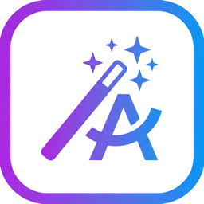

<p align="center">
  
</p>

<h1 align="center">Spellify</h1>

Менюбар-утилита для macOS. Выделяешь текст, жмёшь хоткей — получаешь исправленную версию. Под капотом Gemini API.

## Как работает

1. Выделяешь текст где угодно
2. Жмёшь `Ctrl+Shift+F`
3. Текст заменяется на исправленный

## Установка

Качаешь DMG из релизов, перетаскиваешь в Applications. При первом запуске попросит API ключ и доступ к Accessibility.

Собрать самому:
```bash
./create-dmg.sh
```

## Настройка

API ключ берёшь тут: [Google AI Studio](https://aistudio.google.com/apikey)

В настройках можно поменять модель и хоткей. Рекомендую `gemini-3-flash-preview` — работает лучше всего.

## Ограничения

Gemini API работает не во всех странах. [Список](https://ai.google.dev/gemini-api/docs/available-regions).

## Лицензия

MIT
